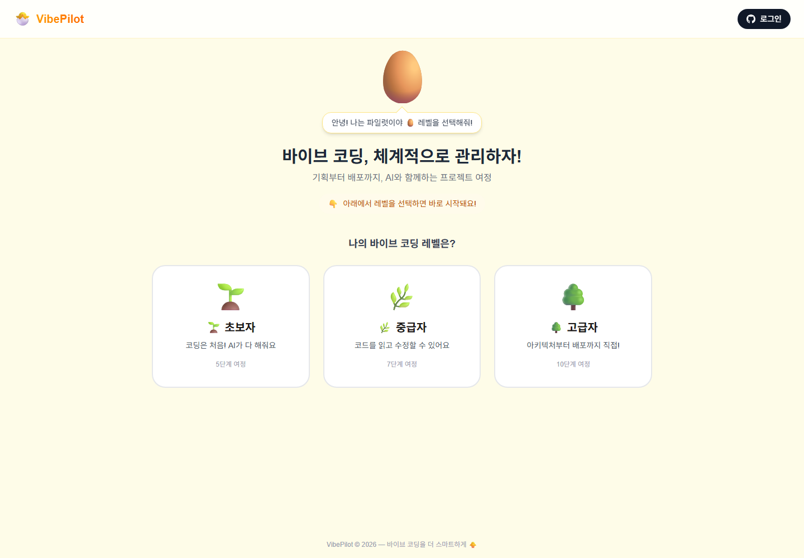
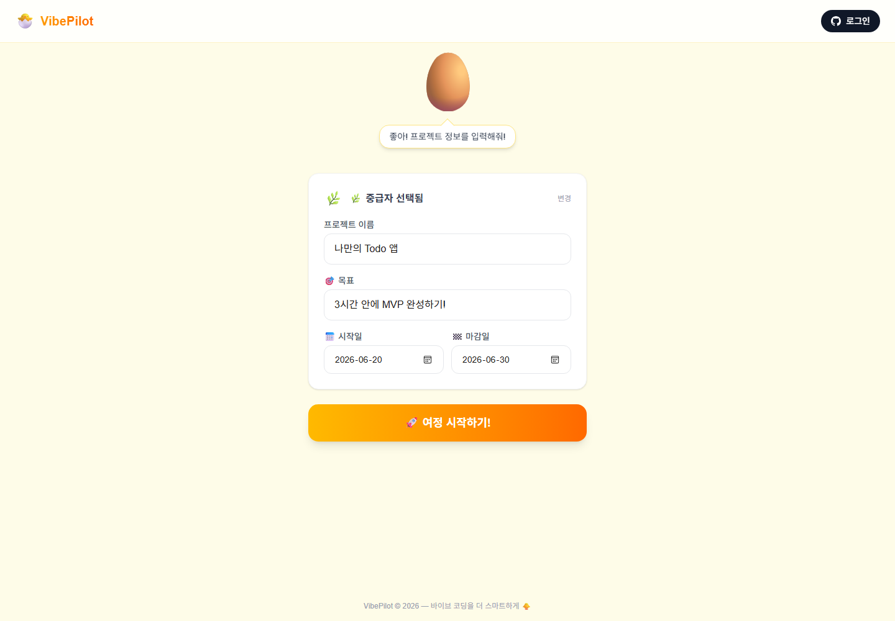
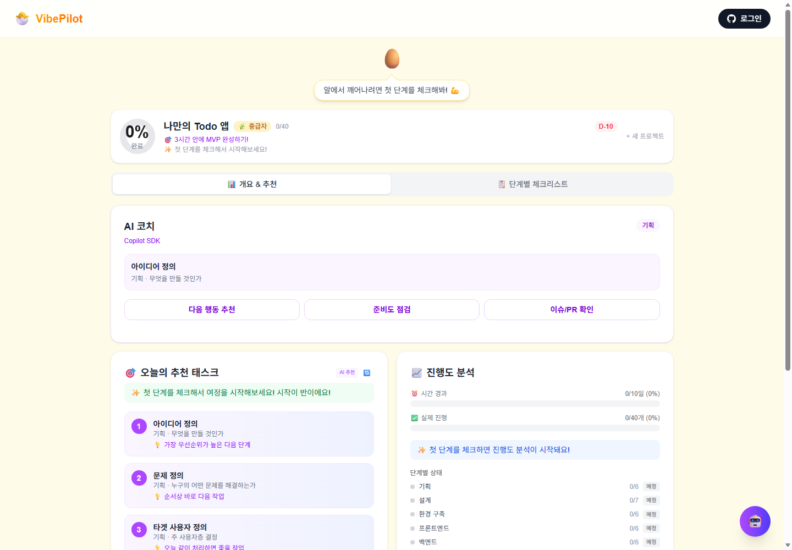
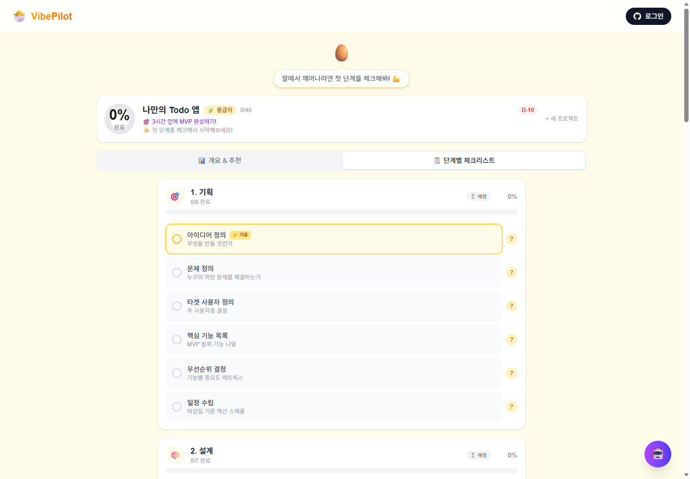

<div align="center">

# 🐥 VibePilot

### 바이브 코딩, 기획부터 배포까지 — AI와 함께 체계적으로

**VibePilot**은 "바이브 코딩(Vibe Coding)"으로 앱을 만드는 개발자가
**기획 → 설계 → 개발 → 배포**까지의 여정에서 *지금 어디쯤 와 있고, 무엇을 다음에 해야 하는지*를
한눈에 관리할 수 있게 돕는 **개인 생산성 앱**입니다.

웹으로도 실행되고, **Windows 데스크톱 앱(.exe)** 으로도 설치해 바로 쓸 수 있습니다.

### 📥 [최신 버전 다운로드 (Windows .exe)](https://github.com/ggaeun324-wq/vibepilot-app/releases/latest)

> 클론·빌드 없이 위 링크에서 설치 파일만 받아 실행하면 됩니다.



</div>

---

## ✨ 한눈에 보기

| | |
|---|---|
| 🎯 **무엇을** | 바이브 코딩 프로젝트의 전체 여정을 단계별로 관리 |
| 👤 **누구를 위해** | 혼자 기획·개발·배포까지 하는 1인 개발자 / 바이브 코더 |
| 🤖 **AI 역할** | `@github/copilot-sdk` 기반 AI 코치가 다음 행동·준비도·레포 상태를 안내 |
| 💻 **실행 방식** | 반응형 웹 + Electron 데스크톱 앱(오프라인 SQLite 내장) |

---

## 📸 스크린샷으로 보는 VibePilot

### 1. 레벨을 고르면 바로 시작 — 문서를 읽을 필요가 없습니다
경험 수준(초보자 / 중급자 / 고급자)에 따라 여정의 세분화 정도가 달라집니다.


### 2. 프로젝트 정보 입력 — 목표와 기간 설정
프로젝트 이름, 목표, 시작일·마감일을 입력하면 D-day가 자동으로 계산됩니다.



### 3. AI 코치가 함께하는 대시보드
현재 단계에 맞는 **AI 코치(Copilot SDK)**, **오늘의 추천 태스크**, **진행도 분석**을 한 화면에서 확인합니다.
AI 제안은 자동 확정이 아니라 *추천*으로 제시되며, 사용자가 적용·무시·재생성할 수 있습니다.



### 4. 단계별 체크리스트
기획부터 배포까지 각 단계를 스텝 단위로 체크하며 진행합니다.
각 스텝의 `?` 버튼을 누르면 구체적인 가이드를 볼 수 있습니다.



---

## 🎯 핵심 기능

### 레벨별 맞춤 여정
| 레벨 | 단계 수 | 대상 |
|------|---------|------|
| 🌱 초보자 | 5단계 | 코딩이 처음, AI에 많이 의존 |
| 🌿 중급자 | 7단계 | 코드를 읽고 수정할 수 있음 |
| 🌳 고급자 | 10단계 | 아키텍처부터 운영까지 직접 |

### AI 코치 (Copilot SDK 핵심 활용)
- **다음 행동 추천 / 준비도 점검 / 이슈·PR 확인** 등 프로젝트 흐름에 밀착된 안내
- `@github/copilot-sdk`의 **에이전트 + 도구 호출(`defineTool`)** 로 프로젝트 컨텍스트를 읽어 응답
- **스트리밍** 응답으로 생성 과정을 그대로 보여주고, 어떤 도구를 사용했는지 **투명하게 표시**
- 3단계 폴백: **Copilot SDK → Azure OpenAI → 오프라인 정적 안내** (AI 미가용 상황에서도 앱은 유용)

### GitHub 레포 코드 분석
- 사용자가 입력한 GitHub PAT(읽기 전용)로 접근 가능한 레포 목록 조회
- 선택한 레포의 파일 트리·대표 파일을 읽어 구조/진행 단계/개선점 분석
- Copilot SDK ↔ GitHub **MCP** 도구 연동으로 레포 컨텍스트 기반 질의응답

### 진행도 대시보드
- 원형 프로그레스 링으로 전체 완료율 시각화
- 시간 경과 vs 실제 진행 비교(앞서가는지/뒤처지는지)
- 다음 미완료 작업 자동 안내, 오늘의 추천 태스크

### 그 외
- 🥚→🐣→🐥→🐔→🦅→🏆 마스코트 성장 시스템
- 이메일/비밀번호 로그인 + HttpOnly 세션 쿠키
- 단계별 일정의 Google Calendar 연동

---

## 💻 데스크톱 앱으로 설치하기 (Windows)

VibePilot은 클라우드 없이 **로컬에서 바로 실행**되는 데스크톱 앱으로 빌드됩니다.
데이터는 사용자 PC의 **SQLite** 파일에 저장되어 오프라인에서도 동작합니다.

### ⬇️ 바로 받기 (권장)
빌드할 필요 없이 [**Releases 페이지**](https://github.com/ggaeun324-wq/vibepilot-app/releases/latest)에서
`VibePilot Setup <version>.exe` 를 내려받아 실행하세요.

1. 설치 마법사에서 설치 경로를 선택 → 시작 메뉴·바탕화면 바로가기 생성
2. 데이터는 `%APPDATA%/VibePilot` 의 SQLite에 저장 (오프라인 동작)
3. SmartScreen 경고가 보이면 `추가 정보 → 실행` (코드 서명되지 않은 개인 빌드)

### 직접 빌드하기 (선택)
```bash
npm install
npm run dist
```

- 결과물: `dist-app/VibePilot Setup <version>.exe` (NSIS 설치 마법사)
- 최초 실행 시 시드 DB가 사용자 데이터 폴더(`%APPDATA%/VibePilot`)로 복사됩니다.

### 데스크톱 개발 모드
```bash
npm run dev          # 1) Next.js 개발 서버
npm run electron:dev # 2) Electron 창 띄우기
```

---

## 🌐 웹으로 실행하기

```bash
npm install
npm run dev
```
브라우저에서 http://localhost:3000 접속.

### 환경 변수 (AI 기능 사용 시)
```bash
AZURE_OPENAI_ENDPOINT=https://<your-resource>.openai.azure.com
MODEL_NAME=<azure-openai-deployment-name>
```
- 로컬에서는 `az login` 상태여야 Azure OpenAI BYOM 경로가 동작합니다.
- 환경 변수가 없어도 앱의 핵심 흐름(여정·체크리스트·진행도)은 그대로 사용 가능합니다.

> ⚠️ **보안**: 모델 인증 정보·시크릿은 서버 사이드에만 두며, 프롬프트에 시크릿을 입력하도록 유도하지 않습니다.
> GitHub PAT는 브라우저 메모리에서만 사용하고 저장하지 않습니다.

---

## 🛠️ 기술 스택

| 영역 | 사용 기술 |
|------|-----------|
| Frontend | Next.js 16 (App Router) · React 19 · TypeScript · Tailwind CSS |
| AI | `@github/copilot-sdk` (에이전트·도구 호출·스트리밍) · Azure OpenAI · GitHub MCP |
| 데이터 | Prisma ORM · SQLite(데스크톱) |
| 데스크톱 | Electron · electron-builder (NSIS) |
| 인증 | bcrypt 해시 · HttpOnly 세션 쿠키 |
| 테스트 | Vitest / node 테스트 |

---

## 🧪 테스트

```bash
npm test
```

핵심 로직(인증, 저장소, 검증, 레포 분석, 프로젝트 병합 등)에 대한 단위 테스트가 포함되어 있습니다.

---

## 📁 프로젝트 구조

```
src/
├── app/
│   ├── api/
│   │   ├── chat/            # AI 코치 (Copilot SDK → Azure OpenAI → 오프라인 폴백)
│   │   ├── recommend/       # 오늘의 추천 태스크
│   │   ├── analyze/         # GitHub 레포 분석
│   │   ├── auth/            # 로그인 / 회원가입 / 세션
│   │   ├── projects/        # 프로젝트 CRUD
│   │   └── mcp/github/      # GitHub MCP 연동
│   └── page.tsx             # 홈 + 대시보드 + 마이페이지 (SPA)
├── components/              # UI 컴포넌트 (AICoachPanel, PhaseTimeline 등)
└── lib/
    └── copilot/             # Copilot SDK 세션·도구·컨텍스트 구성
electron/main.js             # 데스크톱: 번들된 Next 서버 구동 + 창 로드
scripts/prepare-standalone.mjs  # 빌드 산출물 + 시드 DB 패키징
prisma/schema.prisma         # SQLite 스키마
```

---

## 🤝 책임 있는 AI 원칙

- AI 제안은 **자동 실행이 아니라 추천**으로 제시됩니다.
- 사용자가 확인한 진행 상황과 AI가 생성한 안내를 UI에서 **구분**합니다.
- 컨텍스트가 부족하면 AI가 **가정을 드러냅니다**.
- 배포 안내는 준비를 돕는 역할이며, **실제 실행·제출 결정은 사용자**가 합니다.

---

<div align="center">

VibePilot © 2026 — 바이브 코딩을 더 스마트하게 🐥

</div>
